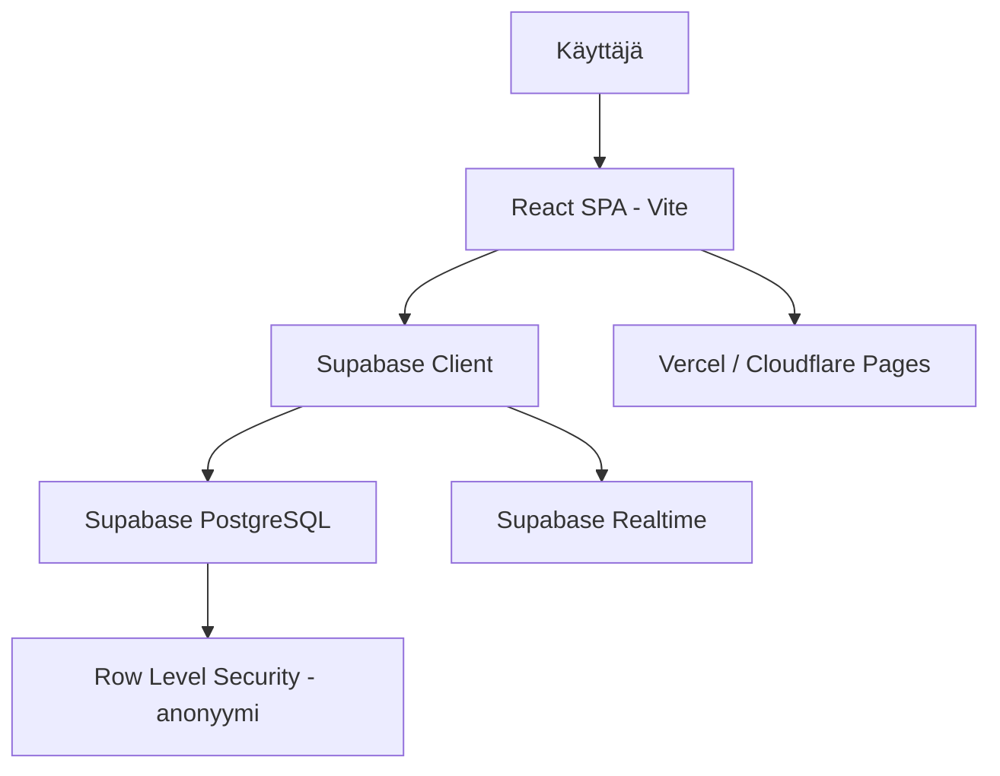

# 📋 Seinä — Projektisuunnitelma

> Versio 1.0 | 2026-06-04

---

## 1. Visio

**Yhden lauseen pitch:** *"Kuvitellaan seinä jossain päin internetiä, johon kuka tahansa voi kävellä, kirjoittaa ajatuksen tarralla tai spraymaalilla, ja poistua — ilman että kukaan tietää kuka oli."*

Seinä on:
- **Anonyymi** — ei käyttäjätilejä, ei kirjautumista, ei seurantaa
- **Visuaalinen** — ajatukset eivät ole pelkkää tekstiä listassa, vaan osa tilaa
- **Kaksikasvoinen** — sama sisältö kahdella estetiikalla: siisti tarra tai rosoinen graffiti
- **Yhteisöllinen** — yksi jaettu tila, ei henkilökohtaisia seiniä (ainakaan aluksi)

---

## 2. MVP — Mitä tehdään ensin

### 2.1 Ydintoiminnallisuus

| # | Ominaisuus | Prioriteetti | Tila |
|---|---|---|---|
| 1 | Ääretön canvas (zoom + pan) | 🔴 Kriittinen | Suunnitteilla |
| 2 | Tarra-lisäys (klikkaus canvasille) | 🔴 Kriittinen | Suunnitteilla |
| 3 | Markdown-renderöinti tarroissa | 🔴 Kriittinen | Suunnitteilla |
| 4 | Tarrojen drag & drop | 🟡 Tärkeä | Suunnitteilla |
| 5 | Tarran editointi (inline-tekstieditori) | 🟡 Tärkeä | Suunnitteilla |
| 6 | Tietokanta-persistenssi (Supabase) | 🔴 Kriittinen | Suunnitteilla |
| 7 | Graffiti-tila (toggle) | 🟡 Tärkeä | Suunnitteilla |
| 8 | Tagit + suodatus | 🟡 Tärkeä | Suunnitteilla |
| 9 | Reaaliaikainen päivitys (Supabase Realtime) | 🟢 Mukava | Myöhemmin |
| 10 | Zoom-to-note (tuplaklikkaus) | 🟢 Mukava | Myöhemmin |

### 2.2 MVP:n ulkopuolelle jäävät (vaihe 2+)

- AI-avustettu kirjoittaminen
- Lappujen linkitys `[[wikilink]]`-tyyliin
- Moninpeli (WebSocket sync)
- Knowledge graph -näkymä
- Kuvien lisäys
- Moderoinnin työkalut
- Mobiilisovellus

---

## 3. Tekninen arkkitehtuuri

### 3.1 Yleiskuva



### 3.2 Frontend

- **React 18+** + **TypeScript**
- **Vite** — build-työkalu
- **Tailwind CSS** — tyylit
- **Konva.js** / **react-konva** — canvas-renderöinti (erityisesti graffiti-tilalle)
- **Zustand** — kevyt tilanhallinta
- **react-markdown** — Markdown → HTML

#### Miksi Konva.js eikä pelkkä DOM?

Graffiti-tila tarvitsee canvas-piirtoa (spray-efektit, vapaalla kädellä). Konva.js antaa molemmat maailmat: voit renderöidä DOM-tyylisiä elementtejä canvasille. Tarra-tilassa voidaan käyttää joko Konvaa tai absoluuttisia divejä — päätetään prototyyppivaiheessa kumpi toimii paremmin.

### 3.3 Backend (Supabase)

| Komponentti | Kuvaus |
|---|---|
| **PostgreSQL** | Pääasiallinen tietokanta |
| **Realtime** | WebSocket-pohjainen live-päivitys |
| **Row Level Security** | Anonyymit INSERT + SELECT -oikeudet |
| **Storage** | Mahdollisia kuvia varten (vaihe 2) |

### 3.4 Tietokantamalli

```sql
-- Viestit / laput / graffitit
CREATE TABLE notes (
  id          UUID PRIMARY KEY DEFAULT gen_random_uuid(),
  x           FLOAT NOT NULL,
  y           FLOAT NOT NULL,
  z           INT NOT NULL DEFAULT 0,
  content     TEXT NOT NULL DEFAULT '',
  tags        TEXT[] DEFAULT '{}',
  style       TEXT NOT NULL DEFAULT 'sticky',  -- 'sticky' | 'graffiti'
  color       TEXT DEFAULT '#fff9a8',           -- taustaväri
  rotation    FLOAT DEFAULT 0,                  -- rotaatio asteina
  width       FLOAT DEFAULT 200,
  height      FLOAT DEFAULT 200,
  created_at  TIMESTAMPTZ DEFAULT now(),
  updated_at  TIMESTAMPTZ DEFAULT now()
);

-- Indeksit
CREATE INDEX idx_notes_created_at ON notes(created_at DESC);
CREATE INDEX idx_notes_tags ON notes USING GIN(tags);
```

#### Graffiti-tilan lisäkentät (harkitaan):

```sql
-- Jos graffiti tallennetaan vektoripiirtona:
ALTER TABLE notes ADD COLIF NOT EXISTS
  drawing_data JSONB;  -- { strokes: [{points: [], color, width}] }
```

### 3.5 RLS-käytännöt (Row Level Security)

```sql
-- Kuka tahansa voi lukea
CREATE POLICY "Anyone can read" ON notes
  FOR SELECT USING (true);

-- Kuka tahansa voi lisätä (anonyymisti)
CREATE POLICY "Anyone can insert" ON notes
  FOR INSERT WITH CHECK (true);

-- Vain palvelu voi päivittää/poistaa
CREATE POLICY "Service can update" ON notes
  FOR UPDATE USING (false);  -- Ei sallittu MVP:ssä

CREATE POLICY "Service can delete" ON notes
  FOR DELETE USING (false);  -- Ei sallittu MVP:ssä
```

Huom: MVP:ssä editointi ja poisto eivät ole sallittuja — tämä pitää seinän aitona ja estää ilkivaltaa monimutkaisemmalla tavalla. Vaiheessa 2 voidaan lisätä "raportoi"-toiminto ja moderointi.

---

## 4. UX-suunnittelu

### 4.1 Kaksi tilaa — yksi toggle

```
┌─────────────────────────────────────────┐
│  🟨 Tarra    |    🎨 Graffiti           │  ← Toggle
├─────────────────────────────────────────┤
│                                         │
│         (Ääretön canvas)                │
│                                         │
│   ┌──────────┐      ┌──────────┐       │
│   │ # Hei    │      │  ***     │       │
│   │ Tämä on  │      │  ***     │       │
│   │ markdown │      │   *      │       │
│   │ #tag1    │      │          │       │
│   └──────────┘      └──────────┘       │
│                                         │
└─────────────────────────────────────────┘
```

### 4.2 Tarra-tila (oletus)

- **Lisääminen:** Klikkaa tyhjää kohtaa → uusi keltainen lappu spawnaa siihen
- **Ulkoasu:** Keltainen pohja (säädettävä väri), pieni satunnainen rotaatio (±3°), varjo
- **Sisältö:** Markdown — otsikot, lihavointi, linkit, koodi
- **Vuorovaikutus:**
  - Raahaa → siirrä
  - Klikkaa → valitse / avaa editori
  - Tuplaklikkaa → zoom lähelle

### 4.3 Graffiti-tila

- **Lisääminen:** Työkalupalkista valitaan spray-kynä, sitten piirretään vapaalla kädellä
- **Ulkoasu:** Spray-efekti (partikkelit, läpinäkyvyys, kerrostuminen)
- **Tekstigraffiti:** Vaihtoehto kirjoittaa tekstiä graffiti-fontilla
- **Väripaletti:** 6-8 perusväriä + custom
- **Undo:** Ctrl+Z viimeiselle vedolle

### 4.4 Yhteiset elementit

- **Zoom/pan:** Hiiren rulla (zoom), raahaus tyhjästä kohdasta (pan)
- **Minimappi:** Oikea alakulma — pieni yleiskuva koko seinästä
- **Tag-paneeli:** Vasen sivupalkki — listaa kaikki tagit, klikkaamalla suodattaa
- **Info:** "Seinällä on N viestiä" — kevyt statistiikka

---

## 5. Omat ehdotukseni & parannukset

### 5.1 💡 "Seinän teema" — ei vain kaksi tyyliä

Ehdotan, että `style`-kenttä on enum, johon voidaan myöhemmin lisätä:

| Tyyli | Kuvaus |
|---|---|
| `sticky` | Keltainen tarra (oletus) |
| `graffiti` | Spray-maalaus |
| `chalk` | Liitutaulu-efekti (musta pohja, valkoinen teksti) |
| `typewriter` | Kirjoituskone-paperi |
| `neon` | Neon-valoefekti (tumma tausta, hehkuva teksti) |

Näin alusta on laajennettavissa. MVP:hen riittää `sticky` + `graffiti`.

### 5.2 💡 "Seinän elinkaari" — ajallinen ulottuvuus

- Seinä ei ole staattinen — vanhat laput **haalistuvat** ajan myötä
- 24h jälkeen opacity 80%, 7d → 50%, 30d → 30%, 90d → 10%
- "Unohduksen estetiikka" — seinä muistaa, mutta unohtaa hitaasti
- Tämä erottaa Seinän kaikista muista viestipalstoista

### 5.3 💡 "Sivellin" — eri kokoiset ja tyyliset graffitit

Graffiti-tilassa käyttäjä valitsee:
- Siveltimen koko (small/medium/large)
- Pehmeys (hard edge → soft spray)
- Väri

### 5.4 💡 Reaktiot — anonyymit, mutta läsnä

Vaikka käyttäjät ovat anonyymejä, he voivat reagoida:
- ❤️ "Tykkään" — lisää pienen sydämen lapun kulmaan
- 🔥 "Tämä on tulta"
- 💭 "Samaa mieltä"

Reaktiot tallennetaan erilliseen tauluun, mutta ilman käyttäjä-ID:tä — pelkkä laskuriperiaate. Tämä tuo yhteisöllisyyttä ilman että anonymiteetti kärsii.

### 5.5 💡 Äänimaisema (kokeellinen)

- Taustalla matala ambient-ääni (valinnainen)
- Uuden lapun ilmestyessä: pieni *click* tai *whoosh*
- Graffitia piirtäessä: spray-ääni (Web Audio API)
- Kaikki äänet pois päältä oletuksena, käyttäjä kytkee päälle

### 5.6 💡 API-ensimmäinen

Vaikka MVP on frontend-vetoinen, suosittelen REST API:n rakentamista alusta alkaen:
- Supabase tarjoaa automaattisesti REST + GraphQL-rajapinnan
- Tämä mahdollistaa myöhemmin: mobiilisovelluksen, botit, CLI-työkalun

---

## 6. Kehityspolku (Roadmap)

### Vaihe 0 — Prototyyppi (viikot 1-2)

```
✅ Projektin scaffoldaus (Vite + React + TS + Tailwind)
✅ Ääretön canvas + zoom/pan
✅ Tarran lisäys klikkaamalla
✅ Perus-Markdown-renderöinti
✅ Supabase-projekti + tietokanta + RLS
✅ Tallennus ja lataus tietokannasta
```

### Vaihe 1 — MVP (viikot 3-4)

```
✅ Graffiti-tila (canvas-piirto)
✅ Toggle tarra/graffiti
✅ Tarrojen drag & drop
✅ Inline-editointi (tuplaklikkaus → textarea)
✅ Tagit + suodatuspaneeli
✅ Visuaalinen hionta (animaatiot, varjot, rotaatio)
✅ Deploy Verceliin
```

### Vaihe 2 — Laajennus (viikot 5-8)

```
✅ Reaaliaikainen päivitys (Supabase Realtime)
✅ Reaktiot (❤️, 🔥, 💭)
✅ Vanhojen lappujen haalistuminen
✅ Minimappi
✅ Useita tyylejä (chalk, typewriter, neon)
✅ ääniefektit (valinnainen)
```

### Vaihe 3 — Yhteisö (viikot 9+)

```
✅ Moderoinnin työkalut (raportointi, piilotus)
✅ Lappujen linkitys [[wikilink]]
✅ Knowledge graph -visualisointi
✅ API-dokumentaatio
✅ PWA / mobiilioptimoitu
```

---

## 7. Riskit ja haasteet

| Riski | Taso | Lievennys |
|---|---|---|
| **Spämmi & ilkivalta** | 🔴 Korkea | Rajoitettu INSERT-tahti (1 per 30s per IP), RLS-pohjainen esto, sanasuodatus (vaihe 2) |
| **Graffitin suorituskyky** | 🟡 Keski | Canvas-pohjainen renderöinti + virtuaalinen näkymä (vain näkyvissä olevat piirretään) |
| **Skaalautuvuus (10 000+ lappua)** | 🟡 Keski | PostgreSQL + GIN-indeksit, sivutettu lataus, canvas-virtuaalinen renderöinti |
| **Anonymiteetin ja turvallisuuden tasapaino** | 🟡 Keski | Selkeät säännöt, RLS, ei IP-tallennusta, väärinkäytön esto ilman käyttäjän tunnistamista |

---

## 8. Mittarit (Mistä tiedämme, että onnistuimme?)

- ✅ Uusi käyttäjä voi lisätä lapun alle 5 sekunnissa (klikkaus → kirjoitus → valmis)
- ✅ Canvas toimii sujuvasti 500+ lapulla (60 fps)
- ✅ Graffiti-tila tuntuu luonnolliselta piirtää
- ✅ Ensimmäinen "kuka tuon kirjoitti?" -hetki käyttäjältä
- ✅ Joku jakaa linkin kaverilleen

---

*Tämä dokumentti päivittyy projektin edetessä. Viimeisin muokkaus: 2026-06-04*
